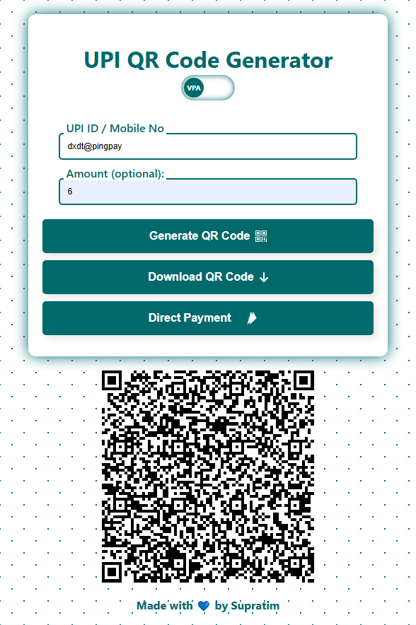
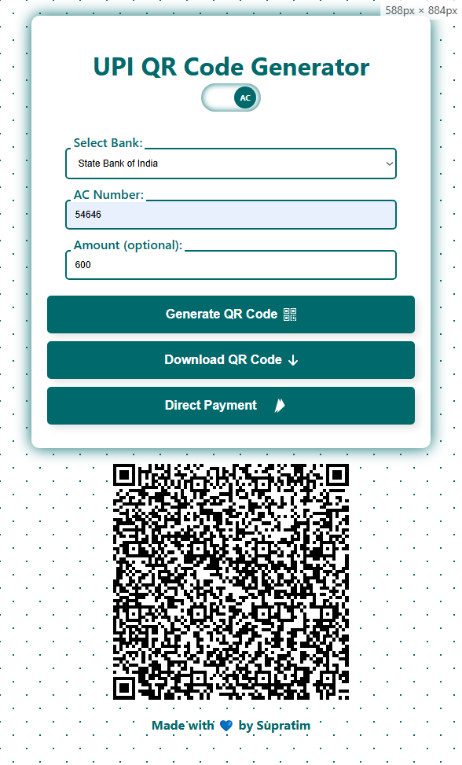

# UPI Payment Integration Project 💳💻

Welcome to the **UPI Payment Integration** project! This project showcases a simple and efficient way to integrate UPI payment functionality using a QR code and a "Make Payment" button.

---

## 🌟 Features

- **QR Code Generation**: Automatically generates a QR code for UPI payments.
- **Responsive Design**: Ensures a modern, user-friendly experience on all devices.
- **Payment Button Functionality**: Redirects users to their UPI app with pre-filled payment details.
- **Custom SVG Icon**: Integrated UPI logo adds a polished touch to the payment button.

---

## 🔁 Project Structure

```plaintext
.
├── index.html       # Main HTML file
├── styles.css       # CSS file for styling
├── script.js        # JavaScript for functionality
└── README.md        # Project documentation (you are here!)
```

---

## 🚀 Getting Started

Follow these steps to set up and run the project on your local machine:

### Prerequisites 🛠️

- A modern web browser (e.g., Google Chrome, Firefox).
- Basic knowledge of HTML, CSS, and JavaScript.

### Steps to Run 🏃‍♂️

1. **Clone the Repository**

   ```bash
   git clone https://github.com/SupratimRK/upi_qr_genarator.git
   cd upi-payment-integration
   ```

2. **Open the Project**

   Open `index.html` in your favorite web browser to view the project.

3. **Test the Payment Button**

   - Click the **Make Payment** button.
   - The button will redirect you to a UPI app if your device is configured properly.

---

## 🖌️ Customization

### Change UPI Details 📑

Update the following variables in the `script.js` file to personalize UPI payment details:

```javascript
const upiID = "your-upi-id@bank";
const payeeName = "Your Name";
const transactionNote = "Payment for services";
const transactionAmount = "100.00"; // Specify your desired amount
```

### Modify Styles 🎨

You can customize the UI by editing the `styles.css` file. For example, to change the button color:

```css
.Btn {
  background-color: #028c3c; /* Replace with your preferred color */
  color: white;
}
```

---

## 🖼️ Screenshots

### QR Code Display



### Make Payment Button



---

## 🤝 Contributing

Contributions are welcome! Follow these steps to contribute:

1. Fork the repository.
2. Create a new branch (`git checkout -b feature-branch-name`).
3. Commit your changes (`git commit -m 'Add some feature'`).
4. Push to the branch (`git push origin feature-branch-name`).
5. Open a Pull Request.

---

## 🛡️ License

This project is licensed under the **MIT License**. Feel free to use, modify, and distribute it as per the license terms.

---

## 📞 Contact

For questions or feedback, feel free to reach out:

- **Email**: [supratimrk@outlook.com](mailto:supratimrk@outlook.com)
- **GitHub**: [SupratimRK](https://github.com/SupratimRK)

---

**Built with ❤️ by Supratim**

